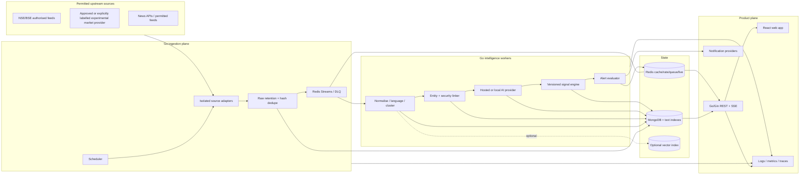

# Architecture



## Deployment components

- `api`: stateless Gin service; REST/SSE, auth, validation, rate limits and health checks.
- `ingestion-worker`: one or more horizontally scaled workers. Redis locks and idempotency keys prevent duplicate polling/processing.
- `analysis-worker`: independently scaled Phase 3 model consumer with provider-specific concurrency and budget controls.
- `market service`: provider-neutral current-snapshot boundary. Its experimental public adapter accepts only public symbols/search terms and has no credential-forwarding path.
- `mongodb`: source of truth for user, evidence, market, signal, audit and historical documents. Unique/TTL/text indexes plus validated writes enforce critical invariants.
- `redis`: cache, distributed locks, per-minute rate state, streams, retries, dead-letter queues and the API-to-SSE event bridge. Redis is not the durable source of truth.
- `web`: React/Vite application. Development uses the Vite proxy; production may use any same-origin static host/reverse proxy that preserves `/api/v1` streaming and security headers.

## Final folder structure

```text
STOCKER/
├── apps/
│   ├── api/                 # Go API entry point
│   └── web/                 # React/Vite/Tailwind application
├── internal/
│   ├── ai/                  # provider-neutral model contract + validation
│   ├── auth/                # hashing, access JWTs, refresh rotation
│   ├── config/              # typed environment configuration
│   ├── domain/              # transport-independent domain types
│   ├── httpapi/             # Gin routes, middleware, handlers, SSE hub
│   ├── ingest/              # adapter contract, processor, dedupe/canonicalisation
│   ├── market/              # provider-neutral quote/search adapters + refresh service
│   ├── signal/              # configurable/versioned scoring engine
│   └── store/               # MongoDB repository, indexes and seeds
├── workers/
│   ├── ingestion/           # fetch/normalise publisher process
│   └── analysis/            # isolated Phase 3 consumer entry point
├── migrations/              # versioned MongoDB data-shape migration policy
├── deployments/             # observability and native deployment config
├── docs/                    # contracts, diagrams, security and operations
├── .env.example
├── Makefile
└── README.md
```

## Trust boundaries

Source content enters as untrusted bytes. Parsing never shares an instruction channel with AI prompts. Numeric facts are allowlisted from validated fields or explicitly attributed excerpts. Model JSON is rejected on unknown fields or invalid bounds. Conclusions link to immutable evidence rows. Signal inputs are snapshotted and never edited retroactively.
