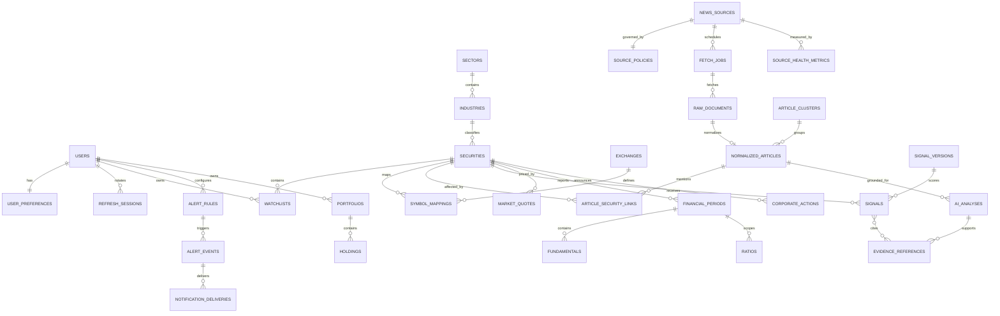

# MongoDB collection model

The collections retain the Phase 1–6 entity envelope under the revised no-candles/no-charts market scope. References use `ObjectID` values, while evidence and historical signal snapshots remain immutable. Quote snapshots can use time-series collections or date-based archival when production volume warrants it.

Critical invariants include an atomic conditional update for the 10-item watchlist, unique source hashes, unique alert deduplication keys, TTL indexes for expiring refresh sessions and retained raw content, immutable signal input snapshots, UTC timestamps, and source/`as_of` on every financial value. API schema validation enforces score bounds and compatible reporting periods before documents are written.

## Phase 2 collections in active use

- `normalized_articles` stores canonical source metadata, retained text, parser version, symbols/sectors, cluster ID, synthetic/official flags, and embedded outbox delivery state.
- `article_security_links` stores deterministic symbol links to the security master.
- `source_states` stores durable RSS/Atom cursor time and conditional-request value.
- `source_health_metrics` stores append-only success/failure samples and circuit state.
- `ingestion_dead_letters` stores terminal outbox failures and replay status.

Story clusters currently use a stable `cluster_id` on each article rather than a separate cluster document. Exact duplicates are rejected by `content_hash`; near duplicates share a cluster after time-windowed text similarity. This keeps Phase 2 queries simple while preserving every collected source record for later evidence analysis.

## Phase 3 collections in active use

- `prompt_versions` stores immutable prompt text, version, schema version and SHA-256 identity.
- `ai_analyses` stores append-only provider/model metadata, language handling, usage/cost and the validated structured analysis.
- `evidence_references` stores exact source excerpts linked to the analysis and collected article.
- `signals` stores append-only `signal-v2` results linked to their analysis, article, security, evidence, freshness watermark and input snapshot.
- `signal_versions` records scoring weights and version metadata.
- `ai_daily_budgets` atomically enforces the configured provider/day cost ceiling.
- `analysis_dead_letters` records items that exhaust analysis attempts without rewriting collected evidence.

## Phase 4 collections in active use

- `market_quotes` stores append-only provider snapshots with day and 52-week ranges, volume, delay/synthetic flags, source URL, upstream `as_of`, and separate retrieval time.
- `fundamentals` stores point-in-time metric arrays. Every metric carries its unit, reporting period, and basis so incompatible values are not silently compared.
- `securities.aliases` supports deterministic company-name linking such as “Ola Electric” to `OLAELEC`, while the NSE symbol, BSE code, and ISIN remain explicit identifiers.
- Sector breadth, movers, peers, risk flags, and evidence-derived calendar events are computed from the latest persisted quote, fundamental, signal, article, and analysis records rather than stored as untraceable conclusions.

## Phase 5 collections in active use

- `alert_rules` stores user-owned, watchlist-scoped event or market-threshold rules with severity/confidence gates, cooldown, quiet hours and per-channel preferences. Revocation is soft so prior deliveries remain auditable.
- `alert_events` stores the exact rule snapshot, triggering values, source timestamp, cited evidence, delivery/read state and a unique SHA-256 deduplication key built from user, rule and cluster or cooldown bucket.
- `notification_deliveries` enforces one delivery per alert event and channel. Only `in_app` is active; external destinations are neither collected nor contacted.
- `briefings` stores one evidence-grounded morning, closing or daily watchlist snapshot per user and UTC date. Items cite either an immutable signal source or a timestamped market-provider snapshot.
- `signal_outcomes` stores idempotent, versioned event-time outcomes joined to the first eligible post-horizon quote.
- `evaluation_leakage` records features whose availability timestamp followed the simulated decision; affected signals are excluded from scoring.
- `evaluation_runs` stores report parameters, counts and dimension slices for reproducibility and audit retention.
