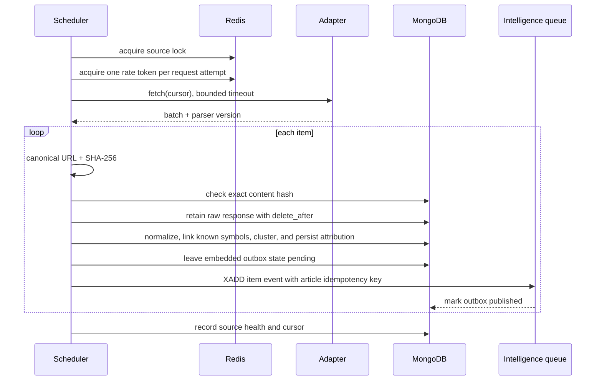

# Source adapters and background jobs

The Go contract is in `internal/ingest/adapter.go`. `Adapter.Fetch` returns source-neutral items plus an opaque cursor and parser version; `Health` is independent so one broken parser cannot stop other sources. `RSSAdapter` supports bounded RSS 2.0 and Atom parsing without following article links. Live adapters fail closed unless attribution, licence, terms URL, retention, polling, and explicit automated-access approval are configured.

## Processing sequence

## Queue topology

- `fetch.schedule`: source and due timestamp. Scheduler uses `(source, scheduled-window)` idempotency keys.
- `document.process`: raw document ID. Retries: 1m, 5m, 20m, 1h plus jitter.
- `article.analyse`: canonical cluster ID so copied stories consume one model call.
- `signal.evaluate`: security ID + evidence watermark + scoring version.
- `alert.evaluate`: user/rule/security/event tuple.
- `notification.send`: provider/channel; its unique `(alert_event, channel)` row prevents duplicate delivery.
- `*.dead`: terminal records after policy-specific attempts. Operators can replay by creating a new idempotent job that references the original.

Workers acknowledge only after MongoDB confirms the durable write. The article document carries its own outbox state, so a crash before Redis delivery leaves the event pending for the next cycle. Redis delivery uses Streams (`stocker:news.created`); consumers must deduplicate by article ID because a crash between `XADD` and acknowledgement can cause at-least-once delivery.

The Phase 3 analysis worker consumes `stocker:news.created` through the `analysis-workers` group. It resolves security entities, enforces the provider/day budget before a call, validates and grounds the result, persists the analysis/evidence/signal idempotently, publishes `stocker:analysis.completed`, and acknowledges only after durable persistence or terminal dead-letter handling.

After five failed outbox deliveries the event is copied to `ingestion_dead_letters` and marked dead. Set `INGEST_REPLAY_DEAD_ON_START=true` for an operator-controlled replay of up to 100 dead events. A source circuit opens after five consecutive fetch failures, probes after a cooldown, and never falls back to unauthorised HTML collection. Raw bodies expire through a TTL index according to the recorded source policy; metadata and hashes remain for audit where permitted.

## Phase 2 API and UI

- `GET /api/v1/news` queries MongoDB and supports text, stock, sector, source, language, official-only, time-range, and pagination filters.
- `GET /api/v1/news/{id}` returns retained text, attribution, licence, cluster size, parser version, and the canonical source link.
- `GET /api/v1/stocks/{symbol}/news` applies the stock link filter.
- `GET /api/v1/system/source-health` reads persisted source and parser health rather than fixtures.
- The React **Live news** navigation opens the News Explorer with filters, cluster counts, synthetic/official labels, pagination, and evidence detail.

## Phase 3 API and UI

- `GET /api/v1/news/{id}/analysis` returns the latest append-only analysis and its linked signals.
- `GET /api/v1/stocks/{symbol}/signals` returns append-only signal history.
- The News Explorer shows event classification, sentiment, materiality, novelty, cited excerpts and provider/prompt/schema/cost metadata separately from the collected source.
- The overview signal spotlight reads persisted signal history; it no longer presents a hard-coded conclusion.

## Phase 4 multi-source stock news

`INGEST_SOURCES_JSON` can define multiple independent RSS/Atom sources. Each enabled entry is validated for explicit automated-access approval, attribution, licence/terms URL, robots review, polling rate, timeout, raw-retention period, and policy expiry before any request is made. Each source receives its own processor, cursor, rate state, circuit state, health history, and polling schedule.

Candidate well-known publisher feeds are documented—but deliberately disabled—in `configs/news-sources.example.json`. Enabling them requires a current terms review or written permission. STOCKER retains only feed-provided text allowed by that policy and always links to the original publisher.

Security aliases allow headlines such as “Ola Electric…” to link deterministically to `OLAELEC`. `GET /stocks/{symbol}/news` returns a maximum of 10 newest clustered results by default; exact duplicates are rejected and near-duplicates remain grouped.

## Phase 5 alert evaluation

The API owns a bounded evaluator loop configured by `ALERT_EVALUATION_INTERVAL` (minimum 10 seconds, default one minute). It refreshes the public market snapshot when configured, evaluates only enabled rules for non-paused watchlist items, and persists the triggering condition plus evidence before delivery. Event rules deduplicate by story cluster and rule; threshold rules deduplicate by rule and cooldown bucket.

Quiet-hour alerts are persisted immediately with a future `deliver_after` timestamp. Delivery rechecks that the rule is still enabled and watchlist alerts are still active, so pausing or revoking delivery during the quiet window cancels it. Authenticated SSE delivery is targeted by user ID; one user's alert is never broadcast to another user's stream.
